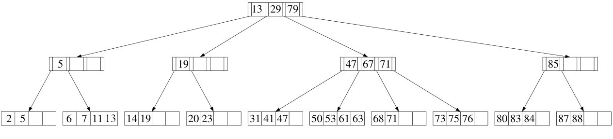

# B+Tree (B-Plus Tree)

L'obiettivo del progetto è quello di fornire una implementazione in C++ degli alberi B+Tree più semplice possibile e facilmente comprensibile, anche al costo di scrivere codice qualitativamente molto lontano dall'utilizzo in un ambiente professionale.

Per la compresione dei B+Tree è propedeutico lo studio dei B-Tree secondo la definizione di Cormen (vedi _Introduzione agli algoritmi e strutture dati_, capitolo 18).
Per quanto riguarda l'implementazione, invece, potrebbe essere utile il mio [precedente repo sui B-Tree](https://github.com/JohnHop/btree)  dove ho tradotto in C++ lo pseudocodice e la descrizione delle funzioni di _ricerca_, _inserimento_ e _rimozione_ di una chiave dall'albero. Anticipo che tra B-Tree e B+Tree le prime due funzioni sono rimaste simili tra loro, mentre per quanto riguarda la rimozione ho utilizzato un approccio diverso.

## Definizione

A quanto pare non esiste una definizione conclamata di B+Tree, anche se tutte quelle che ho trovato in rete differivano solo leggermente.

Ad esempio, per Wikipedia (versione inglese), il sottoalbero la cui radice è il figlio i-esimo di un nodo interno (_link_), deve contenere tutte le chiavi <u>strettamente minori</u> della chiave i-esima dello stesso nodo (vedi [figura](https://en.wikipedia.org/wiki/B%2B_tree#Intervals_in_internal_nodes)). Questa definizione non coincide con quella di **Kerttu** nei suoi (utilissimi!) [appunti](https://web.archive.org/web/20210414050947/https://www.cs.helsinki.fi/u/mluukkai/tirak2010/B-tree.pdf) dove lo stesso sottoalbero citato precedentemente contiene tutte le chiavi <u>minori e uguali</u> della chiave i-esima dello stesso nodo (consulta la figura nei suoi appunti).

La definizione di B+Tree che ho scelto per questo progetto è la stessa di Kerttu, che a sua volta si basa sulla definizione di B-Tree di Cormen, con le ovvie differenze del caso.

In sostanza, negli alberi B-Tree la distinzione tra nodi **interni** e **foglia** è molto più lasca, nel senso che un nodo è foglia solo perché non ha nessun figlio.\
Per gli alberi B+Tree, tutte le chiavi (e i corrispettivi valori) devono trovarsi necessariamente nei nodi foglia mentre i nodi interni, che contengono solamente le chiavi, servono solo per "instradare" la funzione di ricerca verso il figlio che contiene la chiave da ricercare.

## Ricerca

Lo pseudocodice presentato da Kerttu nel paragrafo 4.1
_Code of the search operation_ è abbastanza esplicativo e probabilmente non richede ulteriori chiarimenti.
Nel file `bplustree.cpp` la funzione ha la firma 

```C++
std::pair<Node*,int> BTree::search(const char key)
```

ed è sufficientemente commentata.

## Inserimento

Si basa sull'algoritmo di inserimento di Cormen relativo ai B-Tree. In realtà è sostanzialmente lo stesso eccetto per quanto riguarda la già nota funzione `split_child()`.\
 Quindi, una nuova chiave viene sempre inserita in un nodo foglia appropriato, e se quest'ultimo è già pieno allora viene prima suddiviso attorno alla sua mediana, facendola "salire" al nodo genitore, e poi viene inserita la chiave. 

### `split_child()`

Si trova nel file `bplustree.cpp` e ha la firma 

```C++
void BPlusTree::split_child(Node* parent, const int child_index)
```

dove _`parent`_ è il nodo genitore il cui figlio che deve essere diviso e _`child_index`_ è proprio l'indice del suddetto figlio.

Le differenza rispetto alla versione già vista per gli alberi B-Tree sono evidenziate dal commento _`//* B+Tree ...`_. Cominciamo con

```C++
y->key_count = y->leaf ? t : t-1;
```

che dovrebbe eliminare o meno la mediana dal nodo _`y`_ (osserva, l'eliminazione avviene decrementando il contatore delle chiavi). Questo è dovuto alla netta differenza che esiste tra nodi interni (_link_) e foglia degli alberi B+Tree:

| B-Tree                                                  | B+Tree Tree                                                                                                  |
|---------------------------------------------------------|--------------------------------------------------------------------------------------------------------------|
| La mediana "sale" nel _parent_ venendo eliminata da _`y`_ | La mediana "sale" nel _parent_ ma viene eliminata da _`y`_ soltanto se quest'ultimo è un nodo interno (_link_) |

Infine

```C++
if(y->leaf) {
  z->next = y->next;
  y->next = z;
}
```

serve per il collegamento da _`y`_ → _`z`_ all'interno della lista linkata.

## Eliminazione

Il processo di eliminazione è significativamente più complicato. Ma andiamo per ordine.

L'algoritmo utilizzato da Cormen per i B-Tree adotta un procedimento del tipo _single pass down_. Cito:

> The B-TREE-DELETE procedure then acts in one downward pass through the tree,
without having to back up.

_[da Introduzione agli Algoritmi e Strutture Dati, paragrafo 18.3]_.

Invece, per i B+Tree ho utilizzato il meccanismo opposto, suggerito da Kerttu e [ben illustrato da Wikipedia](https://en.wikipedia.org/wiki/B-tree#Deletion), ovvero

1. viene individuato il nodo foglia contentente la chiave da eliminare utilizzando il meccanismo delle chiamate chiamate ricorsive che "scendono" attraverso l'albero
2. quindi, si "risale" l'albero ribilanciandolo, se necessario, man mano che si _risale_ lo stack delle chiamate ricorsive effettuate precedentemente

La funzione di rimozione di un nodo dall'albero, quella richiamabile dal codice utente, è banalmente

```C++
BPlusTree& BPlusTree::remove(const char key) {
  Node* current = root;

  if(current) {
    delete_helper(key, current);
  }

  return *this;
}
```

L'eliminazione di una chiave avviene sempre in un nodo foglia. Successivamente si possono sviluppare diversi scenari. Cominciamo dai casi più semplici.

### 1° caso semplice (A1)
Si verifica che

1. l'eliminazione di una chiave non porta a nessun ribilanciamente dell'albero
2. non bisogna aggiornare nessun nodo interno (_link_) in seguito all'eliminazione

Infatti, se elimino la chiave con il valore più alto all'interno del nodo, devo aggiornare la stessa chiave presente nel nodo genitore (il _link_). A dopo i dettagli per quanto riguarda questo caso.

Per rendere il codice più semplice e chiaro ho scritto una semplice funzione (molto autoesplicativa)

```C++
delete_key_in_leaf(Node* current, const int key_pos)
```

Pertanto, la funzione `delete_helper()` potrebbe cominciare ad avere la seguente forma

```C++
void BPlusTree::delete_helper(const char key, Node* current) {
  int i = 0;  //Cerco il sottoalbero dove proseguire la ricerca
  while( i < current->key_count && key > current->keys[i] ) {
    i += 1;
  }

  if(current->leaf) {
    if(i < current->key_count) {  //chiave trovata alla posizione #i
      delete_key_in_leaf(current, i);
    }
    //<-- Si raggiunge questo punto se la chiave non viene trovata
  }
  else {  //se @current è un nodo interno (router-link)
    delete_helper(key, current->children[i]); //continuo la ricerca nel figlio #i-esimo
  }
}
```

### 2° caso semplice (A2)
Cosa succede se eliminassimo, all'interno di un nodo foglia, una chiave il cui valore è il più alto tra quelle presente all'interno del nodo?\
Si verificherebbe la violazione della precedente condizione (2.) e la conseguenza sarebbe quella di dover aggiornare il valore di una chiave di un nodo interno suo genitore. Ad esempio

</img>

- se eliminiamo la chiave 5 nel nodo foglia, la funzione deve aggiornare il valore presente nel suo parent passando da 5 → 2. Stessa e identica cosa per la chiave 19
- se eliminiamo 13 dal nodo foglia, l'algoritmo deve essere in grado di aggiornare il valore presente nella root passando da 13 → 11

A tale scopo, risulta utile far restituire a `delete_helper()` il valore della chiave più grande del nodo in cui è avvenuta l'eliminazione. Ma mano che si "risale" l'albero, si controlla se la i-esima chiave del nodo interno (dove si stava procedendo nella "discesa") è uguale a quella che è stata cancellata, e nel caso la si aggiorna con la chiave che è appena diventata la maggiore del nodo eliminato. L'algoritmo così diventa

```C++
char BPlusTree::delete_helper(const char key, Node* current) {
  int i = 0;  //Cerco il sottoalbero dove proseguire la ricerca
  while( i < current->key_count && key > current->keys[i] ) {
    i += 1;
  }

  if(current->leaf) {
    if(i < current->key_count) {  //chiave trovata alla posizione #i
      delete_key_in_leaf(current, i);
      return current->keys[current->key_count-1]; //restituisco la chiave più a destra
    }
    return 0; //<-- Si raggiunge questo punto se la chiave non viene trovata
  }
  else {  //se @current è un nodo interno (router-link)
    char c = delete_helper(key, current->children[i]); //continuo la ricerca nel figlio #i-esimo

    if( i < current->key_count && key == current->keys[i] ) { //la chiave eliminata si trova anche nel nodo interno
      current->keys[i] = c; //quindi aggiorno anche lui con la nuiva chiave più a destra
    }
    return c; //restituisco comunque la chiave più a destra del nodo dove è avvenuta l'eliminazione
  }
}
```

### 1° caso più difficile (B1) e `rotate()`
Supponiamo di avere un albero di ordine _`t`_ (nella definizione di Cormen). Se a causa della eliminazione

1. il nodo corrente ha un numero di chiavi inferiori a _`t-1`_, e
2. un nodo vicino possiede almeno _`t`_ chiavi

allora è possibile prendere dal vicino una chiave in modo da conservare le proprietà dell'albero. L'operazione è detta _rotation_ e differisce leggermente nel caso in cui la chiave viene presa dal vicino a destra oppure da quello a sinistra, con possibile aggiornamento di una chiave di un nodo interno (che rende il tutto più complicato).

La funzione ha la firma 

```C++
void BPlusTree::rotate(Node* parent, const int y_pos_in_parent)
```

ed è ben commentata. L'operazione avviene etichettando con _`y`_ il nodo che riceve una chiave da un vicino, etichettato a sua volta con _`s`_. Per rendere il codice più chiaro, sono state utilizzate alcune funzione "di supporto", quali

- `right_shift()`: esegue uno o più shift a destra delle chiavi (e figli) di un nodo in modo da far spazio a nuove chiavi
- `left_shift()`: complementare alla prima ma di fatto elimina la chiave meno significativa del nodo

Il punto più critico della funzione è probabilmente l'ultimo passaggio, che fa utilizzo della funzione `update_key()` necessaria per aggiornare i valori dei _link_ in seguito alle modifiche causate dalla rotatazione.

La funzione `delete_helper()` si aggiorna aggiungendo

```C++
char c = delete_helper(key, current->children[i]);

if(current->children[i]->less_than_min_keys()) { //Caso B1: il nodo dove ho eliminato la chiave ha meno di t-1 chiavi
  if( (i > 0) && current->children[i-1]->more_than_min_keys() ||  //se un vicino di @current->children[#i] ha almeno t chiavi (minimo + 1)
      (i < current->key_count) && current->children[i+1]->more_than_min_keys()
  ) {
    rotate(current, i); //il figlio alla posizione #i ottiene una chiave da un vicino
  } 
  else { //entrambi i vicini di @current->children[#i] hanno il minimo numero di chiavi
    merged = merge(current, i);
  }
}
```

### 2° secondo (e ultimo) caso più difficile (B2) e `merge()`
Infine, se in seguito all'eliminazione di una chiave si verifica che

- il nodo corrente ha meno di _`t-1`_ chavi
- nessun vicino ha almeno _`t`_ chiavi

allora bisogna _fondere_ (o unire) il nodo corrente con un suo vicino.

La funzione incaricata ha la firma

```C++
Node* BPlusTree::merge(Node* parent, const int children_pos)
```

Probabilmente è la più complicata ma è ben commentata. In breve, gli elementi di _`y`_, che è il nodo sul quale c'è il focus di `delete_helper()`, confluiscono in _`s`_ (il vicino scelto per la fusione) e la conseguenza è la "discesa" di una chiave dal _`parent`_ (come avviene nei B-Tree), anche se in questo contesto di dovrebbe parlare più di _perdita_ di una chiave...

La merge potrebbe "svuotare" la radice a furia di far scendere le chiavi nei suoi figli. Per evitare di rimanere con una radice senza chiavi, facciamo restituire alla `merge()` il puntatore al nodo appena fuso e inseriamo subito dopo in `delete_helper()` una verifica della radice

```C++
Node* merged = merge(current, i);

if(current->key_count == 0) { //se ha zero chiavi significa che era la radice. La "aggiorno"
  delete current; //quindi elimino la root con zero chiavi
  root = current = merged;  //aggiornamento
}
```

## Ultime considerazioni
Nel file `main.cpp` è presente una breve sequenza di operazioni per testare il funzionamento dell'albero.

Come si può osservare, ho scelto chiavi del tipo `char`. In futuro si potrebbe "templatizzare" l'albero utilizzando come chiave un generico tipo `T`.

L'obiettivo del repo non è quello di presentare codice di qualità a livello di produzione ma solo un esempio facilmente comprensibile (almeno così mi auguro) di implementazione di un B+Tree.